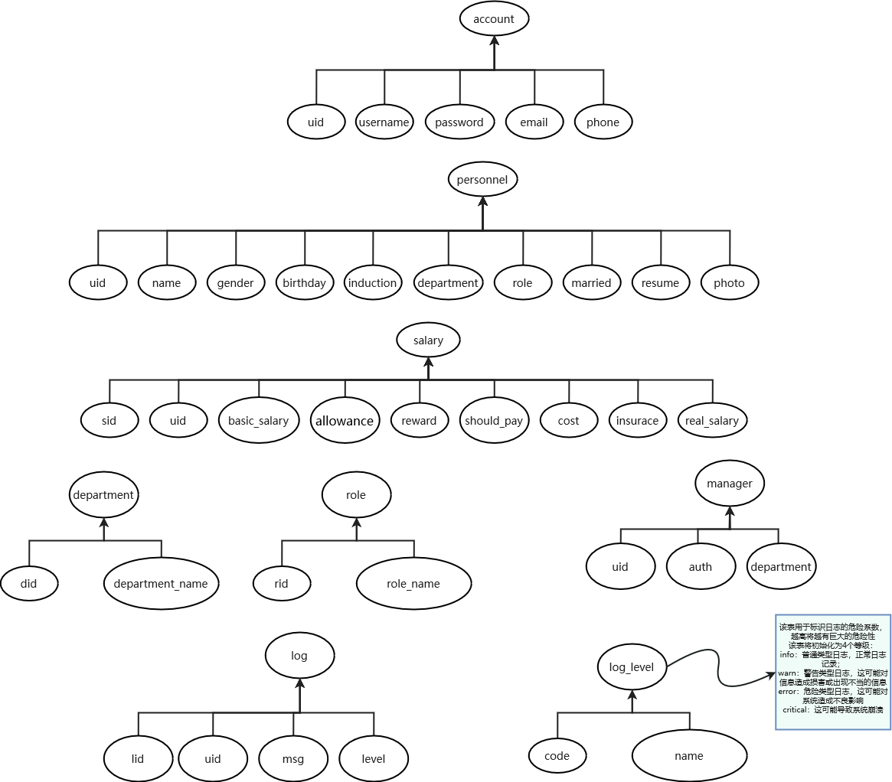

# 人事工资管理系统

## 主要功能

- 人事管理：包括人事数据维护、人事信息查询和人事信息统计

- 工资管理：包括工资月初始化，工资数据维护，工资查询，工资报表
- 基础资料管理：包括部门表，职称表和年份表
- 系统管理：包括操作员管理，口令设置，==权限管理==，系统日志，数据初始化，数据备份，数据恢复和退出系统

-----

其中：

- 数据维护功能：用于录入人事，工资数据，以及修改、撤销，浏览，删除等操作

- 查询：能按多种类别查询人事，工资信息

- 工资计算：工资数据录入后，要能自动计算应发工资和实发工资

- 报表打印：打印职工人事信息报表，职工工资月报表，职工工资条；按多种类别查询的人事、工资信息都能打印输出

- 人事信息统计：按多种类别查询人事信息后给出人数统计信息

------

参考相关数据表结构：

- 人事表（编号，姓名，性别，出生日期，工作日期，部门代码，职称，婚否，简历，相片）

- 工资表（基本工资，岗位津贴，奖励，应发工资，水电，保险，实发工资）

- 部门表（代码，部门名称）

- 职称表（职称代码，职称名称）

- ==年份表（年份代码，年份名称）?==

- 操作员表（操作员代码，操作员姓名，口令，部门，电话）

- 系统日志表（操作员代号，操作员姓名，登录时间，离开时间）

## 数据库表结构

初步建表如下图所示：

